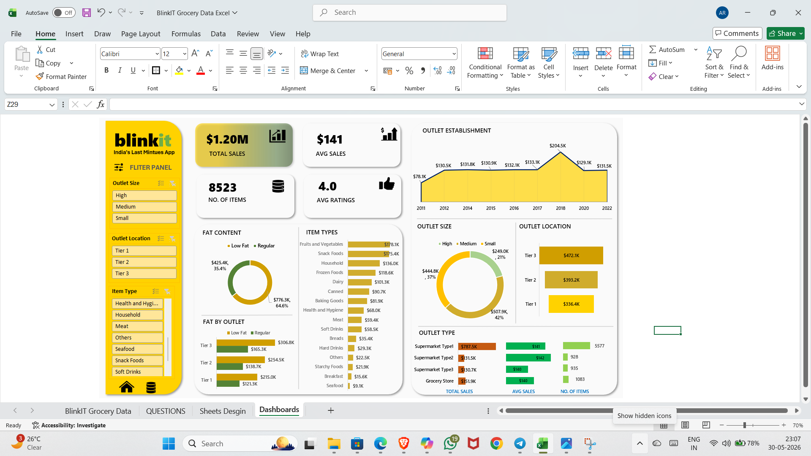

# blinkit-sales-dashboard-excel
Developed an interactive sales dashboard using Microsoft Excel to analyze sales performance, outlet efficiency, product categories, customer ratings, and key business KPIs through dynamic visualizations and slicers.
# 🛒 Blinkit Sales Dashboard (Excel)

## Project Overview

This project is an interactive Sales Dashboard built using Microsoft Excel to analyze Blinkit grocery sales data and generate business insights through data visualization.

The dashboard enables users to explore sales performance, outlet analysis, item categories, customer preferences, and operational KPIs using interactive slicers and charts.

---

## Dashboard Preview

---

## Key KPIs

- Total Sales: $1.20M
- Average Sales: $141
- Number of Items: 8523
- Average Rating: 4.0

---

## Dashboard Features

### Sales Analysis
- Total Sales Performance
- Average Sales Tracking
- Item Count Monitoring
- Customer Ratings Analysis

### Outlet Analysis
- Outlet Establishment Trend
- Outlet Size Analysis
- Outlet Location Analysis
- Outlet Type Performance

### Product Analysis
- Fat Content Distribution
- Fat Content by Outlet
- Item Type Performance

### Interactive Filters
- Outlet Size
- Outlet Location
- Item Type

---

## Tools Used

- Microsoft Excel
- Pivot Tables
- Pivot Charts
- Slicers
- Conditional Formatting
- Data Cleaning
- Dashboard Design

---

## Business Insights

- Tier 3 outlets generated the highest sales.
- Regular fat products contributed the majority of revenue.
- Fruits & Vegetables emerged as the top-selling category.
- Supermarket Type 1 contributed the highest sales volume.

---

## Skills Demonstrated

- Data Cleaning
- Data Analysis
- KPI Reporting
- Dashboard Development
- Data Visualization
- Business Intelligence
- Excel Automation

---

## Project Structure

blinkit-sales-dashboard-excel/

├── BlinkIT_Grocery_Dashboard.xlsx

├── dashboard.png

└── README.md

---

## Author

Abhishek Rawat

Aspiring Data Analyst

Skills:
- Excel
- SQL
- Python
- Power BI
